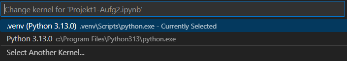

# Install dependencies

All commands should be executed in the *root project folder*

## Python/Pip

```bash
pip install -r requirements --user
```

All dependencies should install and the Notebooks should work!

## Poetry

[Poetry](https://python-poetry.org/) is a dependency manager for Python.  
It uses the supplied `pyproject.toml` to manage *dependencies* and *isolation* using venv

Install `Poetry` (If not already)
```bash
pip install poetry --user
```

Create a `.venv` folder in the project
```bash
mkdir .venv
```

Install dependencies using `Poetry`
```bash
python3 -m poetry install
```

Activate `venv`
```bash
python3 -m poetry shell
```

Alternatively, the interpreter in .venv can be used as *IPython Kernel*

